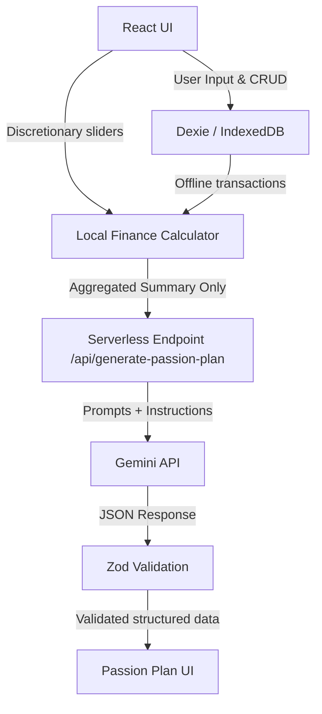

# PassionLedger AI

> Turn everyday spending into a realistic plan for the dream you care about.

Most cashbooks explain where money went. **PassionLedger AI** explains how available money can responsibly fund something meaningful.

This project is built as a competition-ready experience for the **DEV Weekend Challenge**, extending an offline-first bookkeeping application with local calculation engines, what-if simulators, and Google Gemini AI structured planning.

---

## 1. Architecture Flow



---

## 2. Key Features

1.  **Dashboard Integration**: A promotional card banner links directly to the Passion Goals center, displaying your feasibility summary.
2.  **Passion Goal Form**: Configure target names, motivations, saved figures, flexible target settings, priorities, and flexible expense categories.
3.  **Deterministic Finance Calculation Service**: Native offline formulas evaluate average income, expenses, and surplus in the last 90 days. Uses a conservative 80% safety contribution buffer (`SURPLUS_SAFETY_BUFFER`).
4.  **What-If Simulator**: Interactive sliders allow users to adjust optional spending cuts, income boosts, or timeline targets, dynamically shifting the savings runway.
5.  **Runway Projection Chart**: A custom Recharts line chart mapping baseline savings curves, simulated savings tracks, and target goal thresholds.
6.  **Secure Gemini API Endpoint**: Serverless backend endpoint that communicates with Gemini safely using Zod request/response validation schemas, protecting keys on the server side.
7.  **Privacy Boundaries**: Filters out sensitive data (payees, notes, card numbers, accounts). Only aggregated sums and category averages are sent to the model.
8.  **Offline Local Fallbacks**: If the API key is missing or the network is offline, a deterministic local generator constructs milestones and lists, maintaining application stability.
9.  **60-Second Demo**: Single-click demo loading simulated mock datasets, showcasing the full app cycle instantly without writing fake items to your actual transaction books.
10. **PDF Exporter**: Downloads a formatted PDF plan featuring goal statistics, milestone checkmarks, and structured AI advice.

---

## 3. Technology Stack

*   **Frontend**: React 19, TypeScript, Vite, React Router DOM v7
*   **Database**: Dexie.js (IndexedDB wrapper) with schema migration version 7
*   **AI Integration**: Official `@google/genai` SDK + Server-side Zod validation
*   **Visualizations**: Recharts line charts
*   **Exporters**: jsPDF, jspdf-autotable, SheetJS (XLSX)
*   **Styling & Icons**: Custom Vanilla CSS + React Icons (Feather)

---

## 4. Local Installation & Development

### 1. Prerequisite Variables
Create a `.env` file in the root directory:
```bash
GEMINI_API_KEY=your_api_key_here
GEMINI_MODEL=gemini-2.5-flash
```

### 2. Development Run
Install dependencies and run the client-side server locally:
```bash
npm install
npm run dev
```

### 3. Serverless API Endpoint Run
The serverless endpoint matches Vercel serverless specifications. You can run Vercel serverless locally using the Vercel CLI:
```bash
npm i -g vercel
vercel dev
```

---

## 5. Calculations Verification

*   **Case 1: On track**: Simulated savings contribution rate meets or exceeds the required rate. Feasibility becomes `on_track`.
*   **Case 2: Challenging**: Simulated savings contribution rate is positive but below the required rate. Feasibility becomes `challenging_but_possible`.
*   **Case 3: Not Feasible**: Simulated contribution rate is zero or negative. Feasibility becomes `currently_not_feasible`.
*   **Case 4: Already Funded**: Target amount minus saved amount is zero. Feasibility becomes `already_funded`.
*   **Case 5: Clamp guards**: Clamps progress percentages between 0% and 100%, and available months to at least 1 month.

---

## 6. Privacy & Security Policies

1.  **Local Storage**: Real transaction footprint remains inside IndexedDB on the device.
2.  **No Server Persistence**: No middleman databases are used; all synchronizations utilize user-controlled Google Drive sheets.
3.  **Data Isolation**: Only aggregate financial metadata (monthly averages) are sent to Gemini. Notes, phone numbers, contact names, and identifiers are completely stripped.
